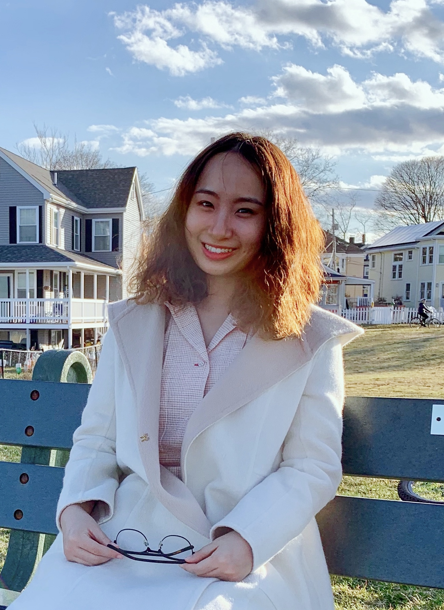

  

    
  

  

    <h1> Rui Liu (刘蕊) </h1>
    
    <h3> Ph.D candidate of <a href="https://www.bu.edu/eng/departments/se/" target="_blank">Systems Engineering</a>, <a href="https://www.bu.edu" target="_blank">Boston University</a> </h3>
    
    
 <strong>Advisor:</strong> <a href="https://sites.bu.edu/aolshevsky/" target="_blank"> Prof. Alex Olshevsky </a> 

    
    
 <strong>Research Interests:</strong> Reinforcement Learning; Distributed Optimization; Multi-agent systems 

    
    
 <strong>Education:</strong> 

    
    
 🎓 <a href="http://english.amss.cas.cn" target="_blank">Academy of Mathematics and Systems Science</a>, <a href="https://english.ucas.ac.cn" target="_blank">University of Chinese Academy of Sciences</a>, M.S., Operations Research and Cybernetics (2017) 

    
    
 🎓<a href="http://en.math.nankai.edu.cn" target="_blank">School of Mathematical Sciences</a>, <a href="https://en.nankai.edu.cn" target="_blank">Nankai University</a>, B.S., Statistics (2014)  

    
    
 <strong>Contact Information:</strong>  📧Email: rliu@bu.edu 
 
  

